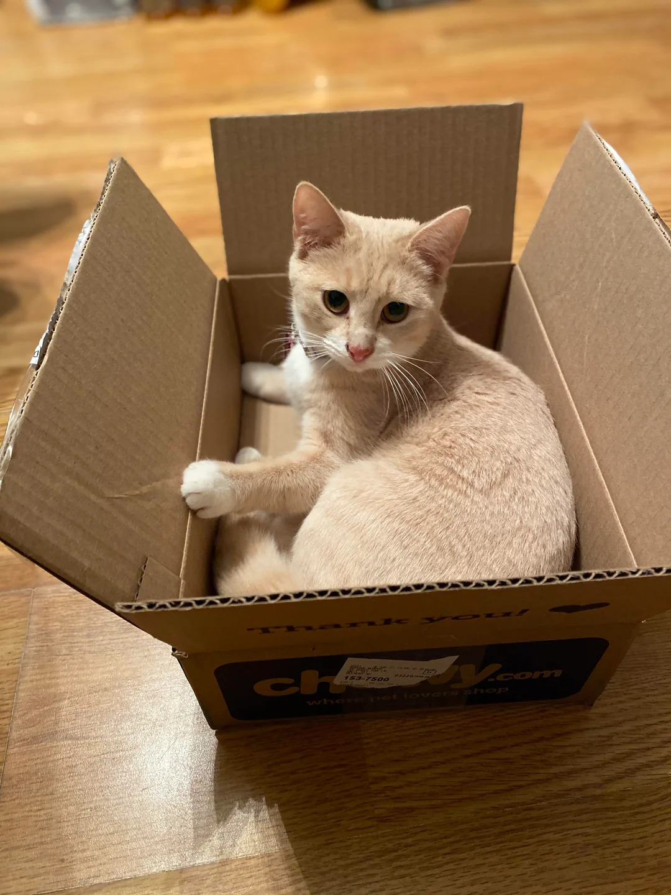

# 🐾🔑 CatKeyLab

<h3 align="center">Free, Private & Powerful Online Hardware Testing Suite & Typing Speed Challenge</h3>

<p align="center">
  <a href="#key-features--included-tools"></a>
  <a href="#nibbles-the-cat--interactive-toys"></a>
  <a href="#internationalization-i18n"></a>
  <a href="#technology-stack--architecture"></a>
  <a href="#web-audio-api-synthesizer--sound"></a>
  <a href="#license"></a>
</p>

---

## 📋 Table of Contents

- [Overview](#-overview)
- [🐱 Nibbles the Cat & Interactive Toys](#-nibbles-the-cat--interactive-toys)
- [✨ Key Features & Included Tools](#-key-features--included-tools)
- [🛠️ Technology Stack & Architecture](#️-technology-stack--architecture)
- [📁 Project Directory Structure](#-project-directory-structure)
- [🚀 Getting Started](#-getting-started)
- [🌐 Internationalization (i18n)](#-internationalization-i18n)
- [🎨 Design System & Ambient Cat Theme](#-design-system--ambient-cat-theme)
- [🔊 Web Audio API Synthesizer & Sound](#-web-audio-api-synthesizer--sound)
- [🔍 SEO & Metadata Coordinator](#-seo--metadata-coordinator)
- [🤝 Contributing](#-contributing)
- [📄 License](#-license)

---

## 📖 Overview

**CatKeyLab** ([catkeylab.com](https://catkeylab.com/)) is a lightweight, high-performance web application created by **Dylan** ([snowyorca.itch.io](https://snowyorca.itch.io/)) built for testing mouse hardware, keyboard switches, WPM typing speed, click velocity, and reaction latency directly inside your web browser.

<p align="center">
  <br>
  <em>Meet the adorable real-life orange cat sitting in a box who inspired Nibbles! 🐱</em>
</p>

Unlike bloated desktop software, CatKeyLab operates **100% client-side**, requiring **zero downloads, zero plugins, zero accounts, and zero tracking**. All hardware test measurements, typing accuracy calculations, and high score benchmarks process locally in your browser sandbox to guarantee absolute privacy and instant performance.

---

## 🐱 Nibbles the Cat & Interactive Toys

CatKeyLab features **Nibbles**, a playful Ginger Tabby Cat wearing a ruby red collar with a shiny gold bell 🔔 who accompanies you while you test hardware!

### 🐾 1. Pupil Tracking & Paw Reactions (`catMascot.js`)
- **Smooth Cursor Tracking**: Nibbles' pupils follow your cursor in real time across the viewport.
- **Paw Swatting**: Paws reach out toward your mouse cursor as you move nearby.
- **WPM Judging**: Nibbles evaluates your typing speed, purring happily for fast typists or squinting judgmentally at typos!
- **Fast Scroll Detection**: Squints in surprise when you scroll rapidly down a page.
- **Click Petting**: Click Nibbles directly to pet him, triggering purrs and floating heart/paw particles (`❤️`, `🐾`).

### 🧶 2. Throwable Yarn Ball Toy (`yarnBall.js`)
- **Physics Drag & Throw**: Drag and flick the Yarn Ball 🧶 across your screen. Features momentum friction damping (`0.94`) and screen boundary bounce physics!
- **Cat Interactivity**: Drag or toss the yarn ball near Nibbles (< 280px) to see both paws and pupils track the yarn in real-time, swatting at the ball silently with playful speech popups (*"my toy!"*, *"swat! 🧶"*, *"purrrrr... yarn!"*).

### 🥣 3. Cat Food Bowl & Fish Feeding (`foodBowl.js`)
- **Interactive Food Bowl**: Click or drag the Cat Food Bowl 🥣 in the bottom-right corner to spawn fresh, draggable **Fish 🐟**.
- **Munching Eating Reactions**: Drag the fish to Nibbles to watch his paws excitedly track the fish. Feeding Nibbles (< 130px) eats the fish with a shrink animation, floating sparkles (`❤️`, `✨`, `🐟`), and cute eating popups (*"nom nom nom! 🐟"*, *"yummy fish!"*, *"thanks human! 🐾"*).

---

## ✨ Key Features & Included Tools

CatKeyLab includes nine specialized, feature-rich interactive modules accessible via client-side hash routing:

### ⌨️ 1. Typing Speed Challenge (WPM) (`#typing-test`)
- **Minimal WPM Testing**: Distraction-free typing test inspired by Monkeytype.
- **Custom Time Limits**: Choose between 15s, 30s, 60s, or 120s testing durations.
- **Mechanical Sound Synthesis**: Synthesizes authentic mechanical key clicks as you type.
- **Live Accuracy & Analytics**: Real-time WPM, Net WPM, accuracy %, raw CPS, and character error tracking.
- **Nibbles Judging**: Nibbles evaluates your performance level after every test!

### 🖱️ 2. Mouse Hardware Tester (`#mouse-test`)
- **Multi-Button Verification**: Interactively tests Left Click (MB1), Right Click (MB2), Middle Click/Wheel (MB3), Side Button 4 (Back), and Side Button 5 (Forward).
- **Scroll Wheel Diagnostics**: Detects scroll direction (Up/Down) and measures scroll velocity.
- **Dynamic Visual Mouse Diagram**: Highlighted SVG diagram updating instantly as buttons are pressed.

### 🖥️ 3. Visual Keyboard Tester (`#keyboard-test`)
- **Interactive Visual Keyboard Canvas**: Highlights pressed keys on a virtual layout in real-time.
- **DOM KeyCode Inspector**: Displays detailed DOM event properties (`key`, `code`, `keyCode`, `location`).
- **Modifier Key Tracking**: Monitors active state for Shift, Control, Alt, and Meta/Command keys.
- **NKRO & Ghosting Test**: Verifies key rollover capabilities across mechanical or membrane switches.

### 🎯 4. Auto Clicker (`#auto-clicker`)
- **Browser-Native Click Simulator**: Simulates continuous automated clicking directly within the page canvas.
- **Customizable Intervals**: Set click intervals in milliseconds or seconds.
- **Target Limit Controls**: Specify a fixed number of target clicks or run infinitely until stopped.
- **Click Types**: Supports Single Click, Double Click, and Right Click mode simulations.

### ⚡ 5. CPS Test (Clicks Per Second) (`#cps-test`)
- **Timed Speed Benchmarking**: Select from preset time intervals (1s, 5s, 10s, 30s, 60s).
- **Personal Best Tracking**: Automatically saves high scores and best CPS rates to `localStorage`.
- **Rank Progression Badges**: Gamified badge achievements (e.g., *Turtle*, *Rabbit*, *Cheetah*, *Lightning*, *Godlike*) based on CPS scores.

### 🚀 6. Click Speed Test (`#click-speed-test`)
- **Advanced Velocity Analytics**: Measures instant click frequency, peak CPS, burst velocity, and consistency metrics.
- **Real-Time Speed Gauge**: Live visual gauge displaying current click speed against historical averages.

### 🔢 7. Digital Click Counter (`#click-counter`)
- **Tactile Digital Tally**: Increment, decrement, or reset tallies with customizable step sizes.
- **Keyboard Navigation**: Press **Spacebar** or **Enter** to increment counts effortlessly.
- **Goal Limit Alerts**: Set custom goal targets with audio and visual completion chimes.
- **Haptic Feedback**: Triggers native device vibration on supported mobile browsers.

### ⏱️ 8. Reaction Time Test (`#reaction-time-test`)
- **Visual Stimulus Benchmark**: Tests visual reaction latency in milliseconds.
- **False-Start Prevention**: Penalty detection for clicking before the indicator turns green.
- **Historical Averages**: Calculates average response times over multiple attempts with rating tiers.

### 👆 9. Double Click Chatter Test (`#double-click-test`)
- **Hardware Chatter & Fault Detector**: Diagnoses worn mouse switches causing unintended double-clicks.
- **Threshold Analysis**: Measures millisecond gaps between consecutive clicks against a chatter threshold (~80ms).

---

## 🛠️ Technology Stack & Architecture

CatKeyLab is built with modern, vanilla web standards for zero bundle overhead and long-term maintainability:

- **Markup**: Semantic HTML5 (`<main>`, `<header>`, `<footer>`, `<nav>`) with ARIA accessibility tags.
- **Styling**: Vanilla CSS3 with CSS Custom Properties (`:root` tokens), HSL color space, glassmorphism overlays, and cat paw watermark grids.
- **Logic**: Modular ES2022+ JavaScript with functional route cleanup handlers.
- **Audio Engine**: Native **Web Audio API** synthesized sound effects (sine/square wave oscillators + exponential gain ramps) eliminating external `.mp3`/`.wav` assets.
- **Routing**: Lightweight hash-based client router (`js/router.js`) handling dynamic component loading and SEO metadata sync.
- **Localization**: Pure JS i18n engine (`js/i18n.js`) supporting 13 languages with dynamic runtime language switching.

---

## 📁 Project Directory Structure

```
catkeylab/
├── index.html                  # Main HTML document & SPA layout shell
├── README.md                   # Project documentation
├── package.json                # Project metadata & deployment scripts
├── css/
│   ├── main.css                # Color tokens, cat theme background, reset & utilities
│   ├── components.css          # UI component styles (buttons, cards, gauges, FAQ, header/footer)
│   └── mascot.css              # Nibbles the Cat vector styling, yarn ball & food bowl rules
├── js/
│   ├── app.js                  # Application entry point & subsystem initialization
│   ├── router.js               # Hash routing engine, tool metadata registry & SEO sync
│   ├── i18n.js                 # Translation dictionary (13 languages) & language manager
│   ├── theme.js                # Theme switcher (Dark / Light mode) with OS preference detection
│   ├── audio.js                # Synthesized Web Audio API sound generator & haptics controller
│   ├── components/
│   │   ├── catMascot.js        # Nibbles the Cat pupil tracking, paw swatting & speech engine
│   │   ├── yarnBall.js         # Interactive Throwable Yarn Ball 🧶 physics component
│   │   ├── foodBowl.js         # Cat Food Bowl 🥣 & Fish Feeding 🐟 component
│   │   ├── header.js           # Site navigation bar, language picker & theme toggle
│   │   ├── footer.js           # Dynamic footer with tool links, copyright & language select
│   │   ├── breadcrumbs.js      # Dynamic breadcrumb navigation bar
│   │   └── faq.js              # Frequently Asked Questions accordion widget
│   └── tools/
│       ├── typingTest.js       # Typing Speed Challenge (WPM) module
│       ├── autoClicker.js      # Auto Clicker simulation engine
│       ├── cpsTest.js          # CPS Benchmark & ranking system
│       ├── clickSpeedTest.js   # Velocity analytics & click speed gauge
│       ├── clickCounter.js     # Digital tally counter
│       ├── mouseTest.js        # Mouse button & scroll wheel hardware tester
│       ├── keyboardTest.js     # Visual keyboard keypress tester
│       ├── reactionTimeTest.js # Visual reaction timer module
│       └── doubleClickTest.js  # Hardware chatter & double-click fault detector
```

---

## 🚀 Getting Started

Because CatKeyLab relies entirely on standard ES Modules and native web APIs, **no build step, transpilation, or heavy npm installation is required**.

### Quick Start (Local Server)

Serve the project locally using any static web server from the project root directory:

#### Option 1: Node.js (`npx serve`)
```bash
npx serve .
```

#### Option 2: Python (Built-in HTTP Server)
```bash
# Python 3.x
python -m http.server 8000
```

#### Option 3: VS Code Live Server Extension
Right-click `index.html` in VS Code and select **"Open with Live Server"**.

Open your browser and navigate to:
```
http://localhost:8000
```

---

## 🌐 Internationalization (i18n)

CatKeyLab features native multi-language support for 13 global languages out of the box:

| Language | Code | Language | Code |
| :--- | :--- | :--- | :--- |
| **English** | `en` | **Dutch** | `nl` |
| **Spanish** | `es` | **Polish** | `pl` |
| **French** | `fr` | **Turkish** | `tr` |
| **German** | `de` | **Russian** | `ru` |
| **Portuguese** | `pt` | **Japanese** | `ja` |
| **Italian** | `it` | **Korean** / **Chinese** | `ko` / `zh` |

Language selection can be toggled via the header navigation dropdown or by appending `?lang=<code>` to the URL (e.g. `https://catkeylab.com/?lang=es#typing-test`).

---

## 🎨 Design System & Ambient Cat Theme

CatKeyLab features a curated cat-themed design system driven by CSS Custom Properties (`:root` tokens):

- **Color Tokens**: Catnip Emerald (`#10b981`), Ginger Tabby Orange (`#f97316`), Soft Salmon Pink (`#fda4af`), and Dark Slate Navy (`#0f172a`).
- **Cat Paw Watermark Pattern**: Handcrafted SVG cat paw watermark background grid layer floating across the page backdrop.
- **Dark & Light Modes**: Automatically respects system OS settings (`prefers-color-scheme`) and persists user preference in `localStorage`.
- **Responsive Layout**: Designed mobile-first, ensuring smooth operation across mobile phones, tablets, laptops, and desktop displays.

---

## 🔊 Web Audio API Synthesizer & Sound

To maintain 100% offline capability and zero network overhead, CatKeyLab programmatically synthesizes audio in real-time:

- **Pure Oscillators**: Uses `AudioContext` with sine/square wave oscillators and exponential gain ramps.
- **Sound Effects**: Synthesizes mechanical typing key clicks, UI button clicks, score achievement chimes, and soft cat purr sounds.
- **Mute Control**: Sound setting stored in browser preferences (`catkeylab_sound`).

---

## 🔍 SEO & Metadata Coordinator

Each tool page automatically updates DOM metadata upon client navigation:

- Dynamic Page Title & Meta Description update (`document.title`, `meta[name="description"]`).
- Canonical URL generation (`catkeylab.com`) and Open Graph (`og:title`, `og:description`, `og:url`) synchronization.
- Multi-language `hreflang` alternate link tags injected into document `<head>`.
- Built-in dynamic FAQ schemas rendered for search engine indexing.

---

## 🤝 Contributing

Contributions to CatKeyLab are welcome! Whether you are adding a new testing tool, improving translation coverage, or refining Nibbles' animations:

1. **Fork the Repository**
2. **Create a Feature Branch** (`git checkout -b feature/awesome-tool`)
3. **Commit Your Changes** (`git commit -m 'Add fantastic new feature'`)
4. **Push to the Branch** (`git push origin feature/awesome-tool`)
5. **Open a Pull Request**

---

## 📄 License

This project is licensed under the **MIT License**. Feel free to use, modify, and distribute CatKeyLab for personal or commercial projects.

<p align="center">
  Made with ❤️ for gamers, typists, and hardware enthusiasts worldwide. 🐾
</p>
